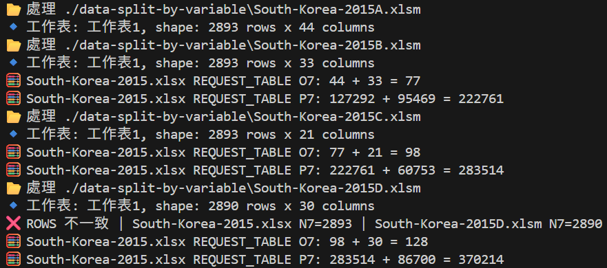
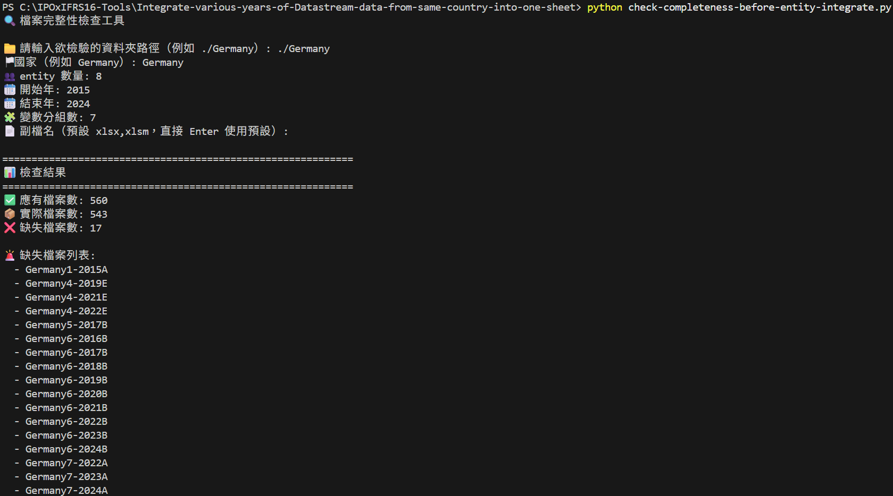

## Workspace（原 Datastream）下載 Excel 須知

用 Excel 下載 Workspace（原 Datastream）的教學，請參考：[Workspace(原Datastream) Data Collection SOP](https://drive.google.com/file/d/1gW6l87DrgSTm3RZfPdKsc6xqmHRGRZBR/view?usp=drive_link)

由於 Workspace（原 Datastream）有下載限制，無法一次輸出多國多年資料，甚至有些變數太多的國家同一年也沒辦法一次載下來，所以需要分段下載後，再利用本工具做資料整合。

下載完成後，若非必要請**避免手動編輯 Excel 內容**。若直接修改儲存格，可能會殘留不可見的空白字元，進而導致程式執行錯誤。 

請將 Excel 檔案存放至：

- 分公司 + 分年 + 分變數：`./data-split-by-entity`
- 分年 + 分變數：`./data-split-by-variable`
- 分年：`./data`

---

## Workspace（原 Datastream）輸出小技巧

1. 下載 Workspace（原 Datastream）時，要確保每個國家各年度的變數，最後併起來應一致

2. 雖然本工具有處理「同一國家多年的變數合併」，但如果你要合併的資料涉及公司群合併（`entity-integrate.py`），目前僅支援「同一國家同一年的公司群合併」。

3. 【分年 + 分變數】（存放於 `./data-split-by-variable`）合併時，理想上同一國家同一年不同的分變數檔 Rows 數應一致，但實務上 Workspace 輸出時可能有些微差異。  
   以 South-Korea-2015 為例，South-Korea-2015D 相較 South-Korea-2015A、South-Korea-2015B、South-Korea-2015C 少了 Type1、Type2、Type3 三間公司的資料，這是因為這三間公司在 D 組變數剛好都是缺失值，Workspace 在輸出時會自動忽略這三間公司。

   

   **解法：**  
   以 South-Korea-2015D 為例，找出少了哪 3 間公司，手動新增 3 rows 並全部補為遺失值，之後再重新執行變數合併（`variable-integrate.py`）。

---

## 程式執行流程

本工具的資料整合流程如下：

1. **同一國家多個公司合併（`entity-integrate.py`）**

   `./data-split-by-entity → ./data-split-by-variable`

2. **同一國家多個變數合併（`variable-integrate.py`）**  

   `./data-split-by-variable → ./data`

3. **同一國家多年資料合併（`year-integrate.py`）**  

   `./data → ./data-2015-2024`

4. **整合所有國家資料（`country-integrate.py`）**  

   `./data-2015-2024 → ./all-countries.csv`

5. **重新命名欄位**  

   `rename-columns-csv.py`: `./all-{國家數量}countries.csv → ./all-{國家數量}countries-renamed.csv`  

   `rename-columns-xlsx.py`: `./all-{國家數量}countries.xlsx → ./all-{國家數量}countries-renamed.xlsx`

---

## 其他實用工具

1. **多個公司合併前，檢查檔案完整性（`check-completeness-before-entity-integrate.py`）**

   以 Germany 為例，我們預期檔案有 Germany1-2015A 到 Germany8-2024G 共 560 個，最後會列出所有缺失的檔名

   

3. **多個變數合併前，檢查分變數檔有沒有少公司（`find-missing-entity-before-variable-integrate.py`）**

   在解決「同一國家同一年不同的分變數檔 Rows 數不一致」的問題時，列出 變數組 X 相較 變數組 Y, 變數組 Z... 少了哪幾間公司，手動補缺失值後再執行 `variable-integrate.py`

---

## 輸入檔案命名規則

程式支援 `.xlsm` 與 `.xlsx` 兩種格式。檔案命名規則如下：

### 【分年 + 分變數 + 分公司】（存放於 `./data-split-by-equity`）

- **國家(第幾組公司)-開始年-結束年(第幾組變數)**  

  例：`Germany1-2015-2018A`

- **國家-年分(第幾組變數)**（僅單一年份）  

   例：`Germany1-2015A`

### 【分年 + 分變數】（存放於 `./data-split-by-variable`）

- **國家-開始年-結束年(第幾組變數)**  

   例：`Switzerland-2015-2018A`

- **國家-年分(第幾組變數)**（僅單一年份）  

   例：`South-Korea-2015A`

### 【僅分年】（存放於 `./data`）

- **國家-開始年-結束年**  

   例：`Finland-2019-2020`

- **國家-年分**（僅單一年份）  

   例：`Finland-2021`

---

## 重新命名欄位
| 原欄位名稱           | 轉換後名稱   | 說明 |
|--------------------|------------|------|
| Type               | DSCD       | 固定重命名 |
| X(WC01254)         | WC01254    | 去掉外層 X() |
| X(WC06705)~U       | XWC06705U  | 去掉括號 & ~，保留末碼 |
| X(WC02051)~U$.1    | XWC02051U  | 去掉 .1 和 $，保留末碼 |
| X(WC18545)~U$      | XWC18545U  | 去掉 ~ 和 $ |
| X(WC04601)~US      | XWC04601U  | 尾碼統一為單個 U |
